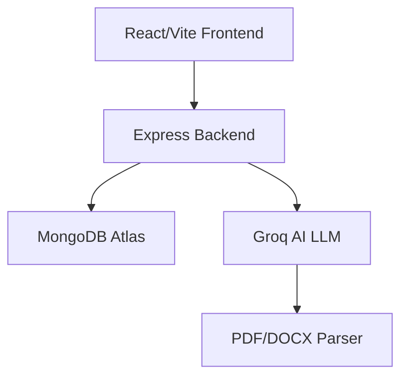

# 🎯 CareerCraft AI - Your AI Career Copilot


<p align="center">
  
  
  
  
</p>

## 🚀 Project Overview
**CareerCraft AI** is a full-stack AI-powered career assistant that:
- 🔍 Analyzes CV vs Job Description for **Match Score %**
- 📝 Generates **personalized Cover Letters**
- 🩺 Performs **CV Health Checks** with AI scoring
- 📊 Shows **user dashboard** with stats (CVs, matches, covers)
- 🎨 Professional light/dark theme UI

## 📁 Project Structure

```
d:/nutri/careercraft-AI/
├── backend/                    # Node.js + Express API
│   ├── src/
│   │   ├── controllers/        # API logic (user-stats, cover, cv-health)
│   │   ├── models/             # Mongoose schemas (User, CV, Job, Match)
│   │   ├── routes/             # API routes (/api/users/stats, /matches)
│   │   ├── services/           # Groq AI, PDF extraction
│   │   └── middleware/auth.js  # JWT auth
│   ├── index.js                # Express server
│   ├── package.json
│   └── uploads/                # CV files
│
├── frontend/                   # React + Vite SPA
│   ├── src/components/         # Login, Dashboard, CoverLetter, CVHealthCheck
│   │   ├── DashboardOverview.jsx # User stats + recent matches
│   │   ├── Login.jsx           # Auth (register/login)
│   │   └── CoverLetter.jsx     # AI generation
│   ├── App.jsx                 # Router + state
│   ├── main.jsx                # Entry
│   └── package.json
│
├── README.md                   # This file
└── TODO.md                     # Progress tracker
```

## 🔥 Features Implemented

| Feature | Status | Description |
|---------|--------|-------------|
| **Auth** | ✅ | Register/Login with JWT |
| **Dashboard** | ✅ | User stats (CVs/Jobs/Matches/Covers) |
| **CV Upload** | ✅ | PDF/DOCX → text + skills extraction |
| **Job Save** | ✅ | Job description storage |
| **Match Analysis** | ✅ | AI-powered CV-Job match % + gaps |
| **Cover Letter** | ✅ | AI-generated personalized letters |
| **CV Health** | ✅ | Grammar, ATS, structure scoring |
| **Recent Matches** | ✅ | User history with delete UI |

## 🛠 Quick Setup (5 mins)

### 1. Backend (MongoDB Atlas required)
```bash
cd backend
npm install
# .env → MONGO_URI=your_mongodb_atlas_connection
npm start
```
**Test:** `curl http://localhost:5000/api/users/stats -H "Authorization: Bearer YOUR_TOKEN"`

### 2. Frontend
```bash
cd frontend
npm install
npm run dev
```
**Frontend:** http://localhost:5173

### 3. Test Flow
```
1. Register/Login
2. Dashboard → Your stats (starts 0→grows)
3. Upload CV + Job Description
4. Match Analysis → Score + gaps
5. Cover Letter → AI generated
6. CV Health → AI analysis
```

## 🌟 Key Tech Stack



## 📊 API Endpoints

| Method | Endpoint | Auth | Description |
|--------|----------|------|-------------|
| POST | `/api/users/register` | No | Create account |
| POST | `/api/users/login` | No | Login + JWT |
| **GET** | `/api/users/stats` | **Yes** | Dashboard stats |
| **GET** | `/api/users/recent-matches` | **Yes** | Recent analysis |
| POST | `/api/upload-cv` | No | CV upload + extract |
| POST | `/api/job-description` | No | Save JD |
| POST | `/api/match-score` | No | CV vs JD analysis |

## 🔧 Common Fixes

| Issue | Solution |
|-------|----------|
| **Dashboard 404** | Backend running? Token valid? |
| **CV Health "no text"** | PDF text layers enabled |
| **Cover dummy text** | Add `GROQ_API_KEY` in backend/.env |
| **Mongo connect** | Atlas IP whitelist + correct URI |

## 📈 Screenshots

```
Dashboard: [Your real stats + recent matches]
Login: [Clean auth UI]
Cover Letter: [AI personalized]
CV Health: [Grammar/ATS score]
```

## 🎉 Credits
- **AI Models:** Groq (llama3-70b-8192)
- **Icons:** Lucide React
- **FYP Complete:** All core features working!

**Deploy:** Vercel (frontend) + Render (backend) + MongoDB Atlas

⭐ **Star if helpful!**

